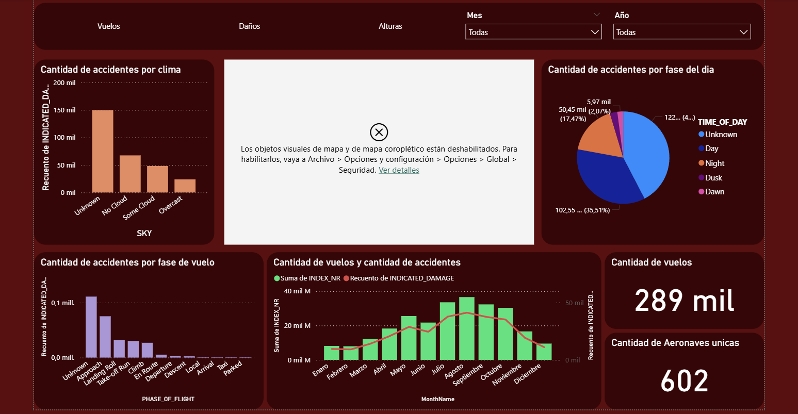

# Análisis Predictivo y BI: Incidentes de Aviación Civil y Fauna

## Descripción del Proyecto
Este proyecto analiza un dataset gubernamental de aviación civil que documenta colisiones entre aeronaves y fauna silvestre. El objetivo principal es descubrir patrones de riesgo, limpiar y transformar datos complejos, y desarrollar modelos predictivos para facilitar la toma de decisiones preventivas, aplicando rigurosamente la metodología **CRISP-DM**.

## Stack Tecnológico
* **Lenguaje:** Python (Análisis, limpieza y modelado).
* **Machine Learning:** Modelos de Clasificación, Regresión y Clustering.
* **Business Intelligence:** Power BI (Dashboards y KRI - Key Risk Indicators).

## Metodología Aplicada (CRISP-DM)

### 1. Comprensión del Negocio y los Datos (EDA)
* Formulación de hipótesis iniciales y definición de variables clave.
* Análisis estadístico exhaustivo: evaluación de medidas de tendencia central (media, moda, mediana), dispersión (desviación estándar) y cuartiles.
* Análisis de correlación y evaluación de datos faltantes.
* Uso de gráficos de distribución para entender el comportamiento de las variables.

### Preparación y Limpieza de Datos
* **Detección y Tratamiento de Outliers:** Uso de diagramas de caja (boxplots) y ejecución de podado de valores atípicos.
* **Transformación:** Imputación de datos faltantes respetando la distribución original.
* **Ingeniería de Características:** Aplicación de *encoding* para variables categóricas y normalización de variables numéricas para optimizar el rendimiento de los modelos.

### Modelado Predictivo
Se desarrollaron e iteraron múltiples modelos de Machine Learning para abordar diferentes ángulos del problema:
* **Clasificación:** Para categorizar el nivel de riesgo o severidad de los incidentes.
* **Regresión:** Para predecir variables continuas asociadas al impacto.
* **Clustering:** Para segmentar incidentes con características o condiciones similares.

## Visualización de Resultados

## Estructura del Repositorio
* `/Notebook`: Jupyter Notebook de Python con el análisis EDA, limpieza y entrenamiento de modelos.
* Dashboard: Archivo de Power BI (`.pbix`).
* `/Images`: Exportaciones visuales.
* `/docs`: Presentación final del proyecto.
